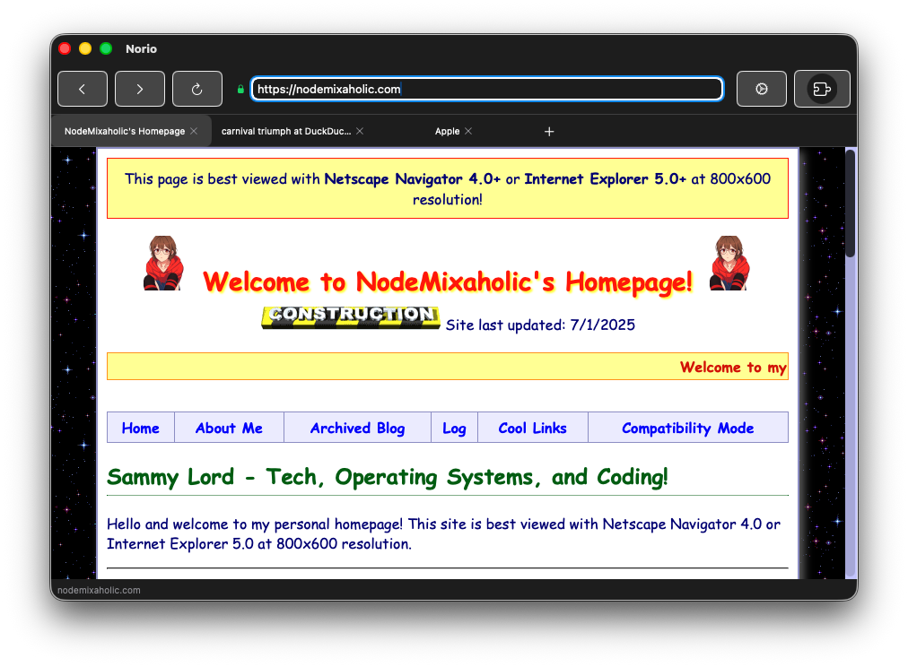
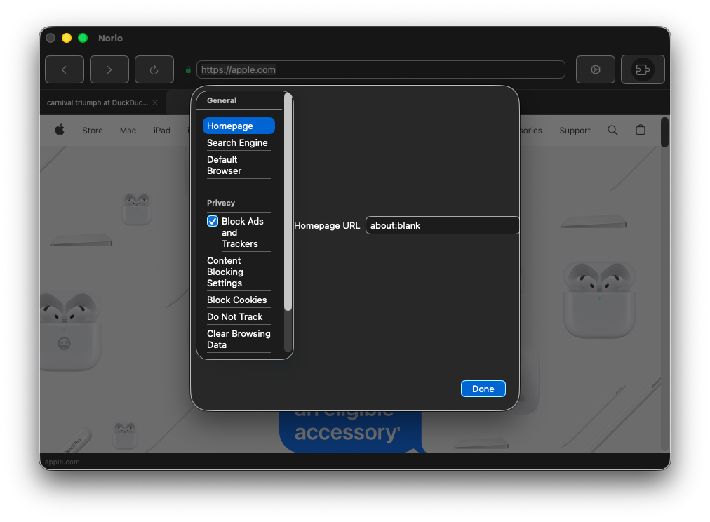

# Norio Browser

Norio is a WebKit-based browser for Apple platforms (macOS, iOS, and iPadOS) that supports Chrome and Firefox extensions.

## Features

- WebKit rendering engine for fast and efficient browsing
- Support for Chrome extensions
- Support for Firefox extensions
- Modern, clean user interface
- Privacy-focused features

### Technical Implementation
- WebKit configuration optimized for gaming performance
- JavaScript enhancements for better pointer lock compatibility
- Automatic fallback handling for different pointer lock scenarios
- Cross-origin support for gaming assets and resources

## Screenshots

### Main Browser Window


### Settings Area


## Requirements

- Xcode 26.0+
- Swift 5.9+
- macOS 26.0+ (for development)
- macOS 14.0+, iOS 26.0+, iPadOS 26.0+ (for deployment)

## Architecture

The browser is built on the following components:

1. **WebKit** - Apple's web rendering engine
2. **Browser Engine** - Custom implementation for tab management, history, bookmarks
3. **Extension System** - Compatibility layers for Chrome and Firefox extensions
4. **User Interface** - Native SwiftUI interface for each platform

## Getting Started

1. Clone the repository
2. Open `Norio.xcodeproj` in Xcode
3. Select the appropriate target (macOS, iOS, or iPadOS)
4. Build and run

## Command-Line Build Instructions

You can also build Norio Browser from the command line using `xcodebuild`:

### Prerequisites

- Xcode Command Line Tools: Install with `xcode-select --install`
- CocoaPods (if used): Install with `sudo gem install cocoapods`

### Building for macOS

```bash
# Debug build
xcodebuild -project Norio.xcodeproj -scheme "Norio macOS" -configuration Debug build

# Release build
xcodebuild -project Norio.xcodeproj -scheme "Norio macOS" -configuration Release build
```

### Building for iOS

```bash
# Debug build for simulator
xcodebuild -project Norio.xcodeproj -scheme "Norio iOS" -configuration Debug -sdk iphonesimulator build

# Release build for device (requires signing)
xcodebuild -project Norio.xcodeproj -scheme "Norio iOS" -configuration Release -sdk iphoneos build
```

### Building for iPadOS

```bash
# Debug build for simulator
xcodebuild -project Norio.xcodeproj -scheme "Norio iPadOS" -configuration Debug -sdk iphonesimulator build

# Release build for device (requires signing)
xcodebuild -project Norio.xcodeproj -scheme "Norio iPadOS" -configuration Release -sdk iphoneos build
```

### Running Tests

```bash
xcodebuild -project Norio.xcodeproj -scheme "Norio macOS" test
```

### Creating an Archive

```bash
xcodebuild -project Norio.xcodeproj -scheme "Norio macOS" archive -archivePath ./build/Norio.xcarchive
```

## License

This project is licensed under the Sammy Public License - see the LICENSE file for details. 
